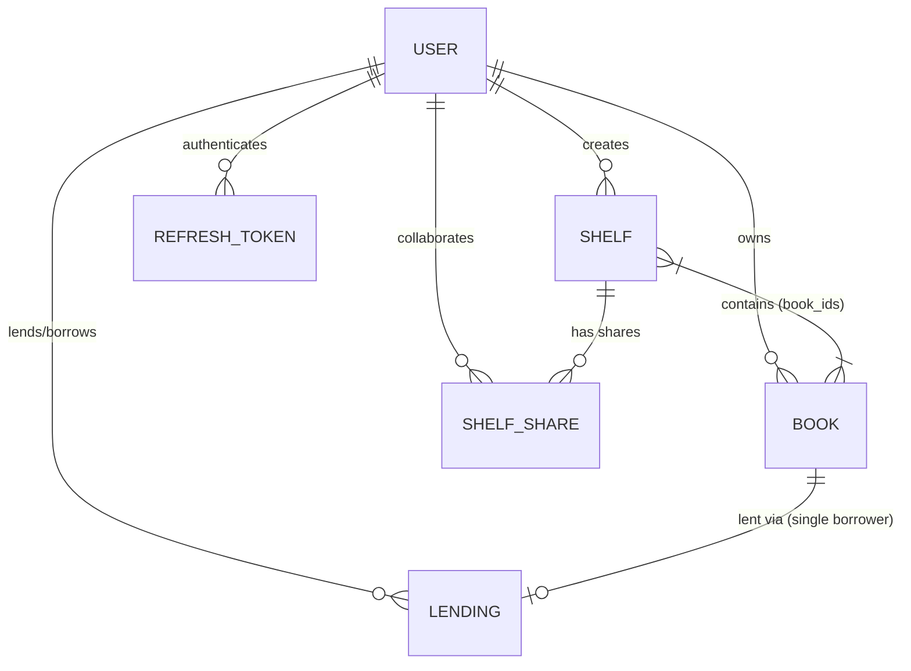

# BookNest 📚🏠

**BookNest** is a modern, full-stack personal library management and collaborative reading platform. Designed for book enthusiasts, BookNest lets users organize their personal book collections by reading status (`Want to Read`, `Reading`, `Finished`), track reading progress page-by-page, curate custom shelves, share shelves with collaborators under granular Role-Based Access Control (RBAC), safely lend books to platform users without double-lending, and receive real-time updates via WebSockets.

---

## 🚀 How to Run (Clean-Clone Tested)

### Prerequisites
- **Node.js**: v18.0.0 or higher
- **Python**: v3.11 or higher
- **MongoDB**: Local MongoDB instance (`mongodb://localhost:27017`) or a MongoDB Atlas URI

### Step 1: Clone Repository
```bash
git clone https://github.com/alekhakumarswain/BookNest.git
cd BookNest
```

### Step 2: Backend Setup
1. Navigate to the backend directory:
   ```bash
   cd backend
   ```
2. Create and activate a virtual environment:
   - **Windows (PowerShell)**:
     ```powershell
     python -m venv venv
     .\venv\Scripts\activate
     ```
   - **Linux / macOS**:
     ```bash
     python3 -m venv venv
     source venv/bin/activate
     ```
3. Install dependencies:
   ```bash
   pip install -r requirements.txt
   ```
4. Environment Configuration:
   Create a `.env` file in the `backend` directory (or copy from `.env.example`):
   ```env
   MONGODB_URI=mongodb://localhost:27017
   DB_NAME=booknest
   JWT_SECRET=super-secret-access-key-booknest-2026-change-in-production
   JWT_REFRESH_SECRET=super-secret-refresh-key-booknest-2026-change-in-production
   ACCESS_TOKEN_EXPIRE_MINUTES=15
   REFRESH_TOKEN_EXPIRE_DAYS=7
   CORS_ORIGINS=http://localhost:3000
   ```
5. *(Optional)* Seed initial demo data:
   ```bash
   python seed.py
   ```
6. Start the FastAPI backend server:
   ```bash
   python run.py
   ```
   *The API server will run at `http://localhost:8000` with interactive API docs available at `http://localhost:8000/docs`.*

### Step 3: Frontend Setup
1. Open a new terminal tab/window and navigate to the frontend directory:
   ```bash
   cd frontend
   ```
2. Install dependencies:
   ```bash
   npm install
   ```
3. Environment Configuration:
   Create a `.env.local` file in the `frontend` directory (or copy from `.env.local.example`):
   ```env
   NEXT_PUBLIC_API_URL=http://localhost:8000
   NEXT_PUBLIC_WS_URL=ws://localhost:8000
   ```
4. Start the Next.js development server:
   ```bash
   npm run dev
   ```
5. Open your browser and navigate to `http://localhost:3000`.

---

## 📊 Data Model & Entity Relationships

BookNest relies on a clean MongoDB document model with strict indexes for data integrity.

### Database Collections

1. **`users`**: Platform user accounts.
   - `id` (`ObjectId`), `name`, `email` *(Unique Index)*, `password_hash`, `created_at`, `updated_at`
2. **`refresh_tokens`**: Active long-lived refresh tokens.
   - `id` (`ObjectId`), `token` *(Unique Index)*, `user_id`, `expires_at` *(TTL Index)*, `created_at`
3. **`books`**: Personal library items.
   - `id` (`ObjectId`), `owner_id`, `title`, `author`, `status` (`Want to Read` | `Reading` | `Finished`), `total_pages`, `current_page`, `rating`, `notes`, `finished_date`, timestamps
4. **`shelves`**: Custom book collections.
   - `id` (`ObjectId`), `owner_id`, `name`, `description`, `book_ids` *(Array of book.id references)*, timestamps
5. **`shelf_shares`**: Collaborator access permissions.
   - `id` (`ObjectId`), `shelf_id`, `user_id`, `role` (`editor` | `viewer`) *(Unique compound index on shelf_id + user_id)*, `created_at`
6. **`lendings`**: Active book lending records.
   - `id` (`ObjectId`), `book_id` *(Unique Index enforcing single-borrower)*, `lender_id`, `borrower_id`, `borrowed_at`
7. **`activity_logs`**: System audit trail & user notifications.
   - `id` (`ObjectId`), `user_id`, `action`, `details`, `metadata`, `created_at`

### Entity Relationship Diagram



---

## 🛠️ Stack Choice & Rationale

| Layer | Technology | Rationale |
| :--- | :--- | :--- |
| **Frontend Framework** | **Next.js 14+ (App Router) / React 19** | Fast Server-Side Rendering (SSR), intuitive file-system routing, component-driven UI architecture, and TypeScript type safety. |
| **Backend Framework** | **Python 3.11+ & FastAPI** | High-performance asynchronous I/O, native Pydantic v2 data validation, OpenAPI documentation generation, and native WebSocket support. |
| **Database & Driver** | **MongoDB + Motor (Async Driver)** | Flexible JSON document store, fast queries with compound indexes, and natural handling of embedded array relationships (`book_ids`). |
| **Authentication** | **JWT (PyJWT) + Passlib (bcrypt)** | Stateless access token verification paired with secure, database-backed HTTP-only refresh token rotation. |
| **Real-time Engine** | **FastAPI WebSockets** | Lightweight, direct WebSocket communication without third-party external server overhead. |
| **Styling & Icons** | **Tailwind CSS + Lucide Icons** | Glassmorphism aesthetics, responsive layouts, and consistent visual hierarchy. |

---

## 🔐 Refresh Token Lifecycle & Auth Flow

BookNest implements a hybrid JWT authentication strategy designed to protect against Cross-Site Scripting (XSS) and token theft.

```
+---------------+                +-------------------+                +-------------------+
| Next.js Client|                |  FastAPI Backend  |                | MongoDB Database  |
+-------+-------+                +---------+---------+                +---------+---------+
        |                                  |                                    |
        | 1. POST /api/auth/login          |                                    |
        |--------------------------------->| Verify credentials                 |
        |                                  | Save Refresh Token                |
        |                                  |----------------------------------->|
        | 2. Returns Access Token (JSON)   |                                    |
        |    + Set HTTP-only Cookie        |                                    |
        |<---------------------------------|                                    |
        |                                  |                                    |
        | 3. Request API (Bearer token)    |                                    |
        |--------------------------------->| Validates Access Token             |
        | 4. Token Expired (401 error)     |                                    |
        |<---------------------------------|                                    |
        |                                  |                                    |
        | 5. Silent POST /api/auth/refresh |                                    |
        |    (Cookie attached automatically)| Verify in DB & Issue new tokens    |
        |--------------------------------->|----------------------------------->|
        | 6. New Access Token returned     |                                    |
        |<---------------------------------|                                    |
        | 7. Retry Original Request        |                                    |
        |--------------------------------->| Request succeeds!                  |
```

- **Access Token**: Short-lived (15 minutes). Stored in client memory / `localStorage` and attached to outgoing requests in the `Authorization: Bearer <token>` header.
- **Refresh Token**: Long-lived (7 days). Stored in the MongoDB `refresh_tokens` collection and issued to the client as an `httpOnly`, `SameSite=Lax`, `Path=/api/auth` HTTP cookie (inaccessible to JavaScript).
- **Silent Refresh Interceptor**: When an access token expires, the frontend Axios response interceptor catches the `401 Unauthorized` response (`ACCESS_TOKEN_EXPIRED`), issues a request to `/api/auth/refresh`, updates the stored access token, and transparently retries the original request without user interruption.
- **Revocation / Expiry**: On logout or refresh token expiry, the token record is removed from MongoDB and the cookie is cleared.

---

## 🛡️ Enforcing Granular Shelf Roles (RBAC)

Shared shelves support three explicit roles:
1. **Owner**: The shelf creator. Full privileges: edit name/description, delete shelf, add/remove books, share shelf, assign roles, and revoke collaborators.
2. **Editor**: Collaborator with write access to books. Can add and remove books from the shelf. Cannot rename/delete the shelf or manage collaborators.
3. **Viewer**: Collaborator with read-only access. Can view the shelf and books. Cannot make modifications.

### Backend Role Enforcement & Preventing Viewer API Bypasses

Role enforcement is executed on every backend endpoint using the `get_shelf_user_role(db, shelf_id, user_id)` helper:

```python
async def get_shelf_user_role(db, shelf_id: str, user_id: str) -> Optional[str]:
    shelf = await db.shelves.find_one({"_id": ObjectId(shelf_id)})
    if not shelf:
        return None
    if str(shelf["owner_id"]) == user_id:
        return "owner"
    
    share = await db.shelf_shares.find_one({"shelf_id": shelf_id, "user_id": user_id})
    return share["role"] if share else None
```

If a **Viewer** attempts to bypass the UI and issue a direct REST request (e.g., `POST /api/shelves/{shelf_id}/books?book_id=123`), the endpoint verifies the role before writing to MongoDB:

```python
role = await get_shelf_user_role(db, shelf_id, current_user["id"])
if role not in ["owner", "editor"]:
    raise HTTPException(
        status_code=status.HTTP_403_FORBIDDEN,
        detail="Only shelf owners and editors can add books to this shelf"
    )
```
Direct API calls by unauthorized roles are immediately rejected with **HTTP 403 Forbidden**.

---

## ⚡ Real-Time WebSocket Architecture

BookNest uses FastAPI WebSockets to deliver instantaneous UI updates across users.

### Handshake & Authentication
WebSockets connect via `ws://localhost:8000/api/ws?token=<JWT_ACCESS_TOKEN>`. The backend validates the JWT during the handshake (`decode_access_token`). Sockets with missing or expired tokens are rejected immediately (`close(code=4001)`).

### Targeted Event Scoping (No Global Broadcasts)
The backend `ConnectionManager` maps active connections by `user_id`:
- **User Scoped Events**: When a book is lent or returned, WebSocket messages are sent exclusively to the lender and borrower's connection sets (`user:<user_id>`).
- **Shelf Scoped Events**: When a book is added to or removed from a shared shelf, `log_activity` identifies all collaborators (`owner_id` + `user_id`s in `shelf_shares`) and broadcasts the event directly to those specific users.

### Disconnects & Reconnects
- **Keep-Alive Ping**: The frontend sends a `{ "action": "ping" }` message every 25 seconds to keep the socket alive through proxies.
- **Auto-Reconnection**: If connection drops, the `WebSocketProvider` catches the `onclose` event and automatically attempts reconnection after 3 seconds, maintaining seamless state upon connection recovery.

---

## 💡 Engineering Challenges & Solutions

1. **Race Conditions in Concurrent Silent Token Refresh**:
   - *Problem*: When a page loaded 5 requests simultaneously with an expired access token, all 5 failed with `401`, triggering 5 parallel refresh requests.
   - *Solution*: Implemented an Axios queueing mechanism (`failedQueue`) in [`frontend/lib/api.ts`](file:///f:/Projects/BookNest/frontend/lib/api.ts). The first 401 sets `isRefreshing = true` and triggers `/api/auth/refresh`, while subsequent failing requests return a Promise stored in `failedQueue`. Once refreshed, the queue resolves and retries all original requests cleanly.
2. **Preventing Double-Lending in MongoDB**:
   - *Problem*: Without native SQL foreign key constraints, concurrent lending requests could result in a book being lent to two borrowers simultaneously.
   - *Solution*: Created a unique database index on `lendings.book_id` in MongoDB. Attempting to insert a duplicate lending record fails at the database layer with a code 11000 duplicate key error, which FastAPI handles gracefully as an HTTP 400 validation error.

---

## ⚠️ Known Issues & Limitations

- **Email Notifications**: Activity events trigger in-app WebSocket notifications; transactional email notifications (e.g. SMTP/SendGrid) are currently not configured.
- **Custom Image File Uploads**: Books render styled UI covers; custom image uploads to S3/Cloudinary are not currently included.

---

## 🔮 Future Improvements

- **Open Library API Integration**: Automatic metadata lookup by ISBN to autofill title, author, total pages, and cover artwork.
- **Offline PWA Support**: Service Worker caching with IndexedDB for reading progress logging offline.
- **Analytics & Reading Streaks**: Expanded dashboard visualizations for yearly reading goals, pages read per day, and reading velocity charts.

---

## 🧠 AI Usage & Learnings

- **UI System & Aesthetics**: AI was used to draft glassmorphism styling, curated color tokens, and responsive UI layouts in Tailwind CSS.
- **Concurrency & Resilience Patterns**: Leveraged AI to refine Axios interceptor promise queues and WebSocket reconnection loops.
- **Key Learnings**: Gained deep hands-on experience in building robust JWT refresh flows with HTTP-only cookies, enforcing multi-tenant RBAC in document databases, and scoping real-time WebSocket connection pools.
