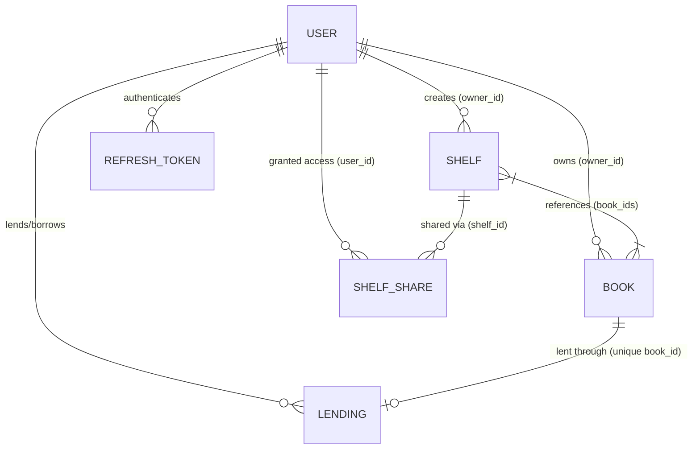

# BookNest 📚🏠

> A collaborative personal library management platform engineered with FastAPI, MongoDB, Next.js 14, and real-time WebSockets.

---

## 1. Overview

**BookNest** is a full-stack platform designed for book enthusiasts to manage personal library collections, track page-by-page reading progress, organize custom shelves, share shelves with collaborators under granular Role-Based Access Control (RBAC), lend books safely without race conditions or double-lending, and receive instant updates across active user sessions via scoped WebSockets.

Rather than treating library management as simple CRUD operations, BookNest approaches the domain through **system design constraints**, enforcing strict ownership boundaries, server-side data invariants, multi-tenant RBAC dependencies, and event-level authorization.

---

## 2. 🧠 Engineering Approach & System Design

### 2.1 Requirement Decomposition

Before writing implementation code, the system requirements were decomposed into five structural layers:

1. **User-Owned vs. Shared State**:
   - *User-Owned State*: Books and Shelves belong to a specific `owner_id`. A user has default full authority over their owned entities.
   - *Shared State*: Shelves can be shared with other users via `shelf_shares` records. Shared books inherit read/write permissions based on explicit collaborator roles (`editor`, `viewer`).
2. **Cross-User Operations**:
   - Lending books requires linking two distinct user identities (`lender_id` and `borrower_id`) without granting the borrower write access to the owner's book properties (title, notes, status).
3. **State Transitions**:
   - Book status progression (`Want to Read` → `Reading` → `Finished`) is governed by validation rules rather than arbitrary manual input.
4. **Operations Requiring Database-Level Guarantees**:
   - Guaranteeing that a book cannot be lent to multiple borrowers concurrently requires database-level unique constraints, not merely application-level checking.
5. **Operations Requiring Real-Time Propagation**:
   - Actions affecting shared resources (adding a book to a shared shelf, altering collaborator roles, lending or returning a book) require targeted real-time event dispatching without leaking events to unconcerned users.

---

### 2.2 Core Domain Invariants

The architecture enforces strict invariants across all domain models:

```text
User-owned data
└── User can only mutate resources they explicitly own.

Shared shelf
├── Owner → Full control (modify shelf metadata, add/remove books, manage roles, delete shelf).
├── Editor → Modify books on shelf (add/remove books). Cannot manage shelf access or delete shelf.
└── Viewer → Read-only access to shelf and contained books. Cannot alter shelf content.

Lending
├── Target book must exist in DB.
├── Target book must belong to the lending user (owner_id == lender_id).
├── Borrower cannot be the owner (borrower_id != lender_id).
└── One active lending per book (guaranteed by UNIQUE database constraint on lendings.book_id).

Reading progress
├── current_page >= 0
├── current_page <= total_pages
├── total_pages must be set (> 0) before logging progress
└── current_page == total_pages → Triggers automatic transition to 'Finished' with finished_date.
```

---

### 2.3 State Transitions

Book state is governed by a formal state machine:

```text
                  ┌────────────────┐
                  │  Want to Read  │
                  └───────┬────────┘
                          │
                          │ start reading / set current_page > 0
                          ▼
                  ┌────────────────┐
                  │    Reading     │
                  └───────┬────────┘
                          │
                          │ current_page == total_pages (validated)
                          ▼
                  ┌────────────────┐
                  │    Finished    │
                  └────────────────┘
```

> **Design Principle**: `Finished` is not merely a dropdown selection on the frontend. It is a **derived state transition** triggered by validated page progress. When `current_page` reaches `total_pages`, the backend automatically updates the status to `Finished` and sets `finished_date = now()`.

---

### 2.4 Authorization Model

Shelf access permissions follow a strict Role-Based Access Control (RBAC) matrix:

| Operation | Owner | Editor | Viewer | Non-Collaborator |
| :--- | :---: | :---: | :---: | :---: |
| View shelf & contained books | ✅ | ✅ | ✅ | ❌ (403) |
| Add book to shelf | ✅ | ✅ | ❌ (403) | ❌ (403) |
| Remove book from shelf | ✅ | ✅ | ❌ (403) | ❌ (403) |
| Rename / edit shelf details | ✅ | ❌ (403) | ❌ (403) | ❌ (403) |
| Share shelf with new user | ✅ | ❌ (403) | ❌ (403) | ❌ (403) |
| Modify collaborator role | ✅ | ❌ (403) | ❌ (403) | ❌ (403) |
| Revoke collaborator | ✅ | ❌ (403) | ❌ (403) | ❌ (403) |
| Delete shelf | ✅ | ❌ (403) | ❌ (403) | ❌ (403) |

> **Security Mandate**: The frontend uses this authorization matrix to render appropriate UI controls, but **the backend independently enforces every authorization check on every request**. UI visibility is treated purely as a user experience convenience—never as a security boundary.

---

### 2.5 Consistency & Concurrency Strategy

Preventing race conditions (such as double-lending a book during near-simultaneous user requests) highlights the difference between naive application checks and database-backed invariants:

#### Naive Application Check (Vulnerable to Race Conditions):
```text
Client A ──► Read: Is book lent? (False) ──────┐
                                              ├──► Insert Lending A & Lending B (RACE CONDITION!)
Client B ──► Read: Is book lent? (False) ──────┘
```

#### Database Invariant (BookNest Implementation):
```text
Database Index: UNIQUE(lendings.book_id)

Client A ──► Attempt Insert Lending A ──► Success (DB Lock)
Client B ──► Attempt Insert Lending B ──► Duplicate Key Error (Code 11000) ──► Returned 400 Bad Request
```

Because two concurrent API requests can both observe `book is available` before either completes insertion, **the database unique index is the final authority on concurrency**.

---

### 2.6 Real-Time Event Model

Rather than utilizing a global broadcast model (which risks leaking sensitive user actions or shared shelf updates to unconcerned users), BookNest implements **targeted, authorization-scoped event delivery**:

```text
                                  WebSocket Gateway
                                         │
                    ┌────────────────────┴────────────────────┐
                    ▼                                         ▼
           User-Scoped Events                       Shelf-Scoped Events
                   │                                         │
     Targeted to lender / borrower             Targeted to owner & collaborators
                   │                                         │
                   ▼                                         ▼
         User Room Delivery                         Shelf Room Delivery
```

> **Design Principle**: I intentionally avoided a global broadcast model because **authorization applies to event delivery just as strictly as REST API endpoints**.

---

## 3. System Architecture

```text
+-----------------------------------------------------------------------+
|                          Next.js 14 Frontend                          |
|  - React 19 / TypeScript / Tailwind CSS / Lucide Icons                |
|  - Axios API Client + Silent JWT Refresh Interceptor                  |
|  - WebSocket Context Listener with Auto-Reconnection                  |
+-----------------------------------+-----------------------------------+
                                    |
                    HTTP / REST     |      WebSockets (WSS)
                                    v
+-----------------------------------+-----------------------------------+
|                     Python (FastAPI) Backend                          |
|  - Python 3.11+ / FastAPI / Pydantic v2 / Uvicorn                     |
|  - JWT Auth + Passlib (bcrypt) + Dependency Injection                 |
|  - Motor Async Driver for MongoDB                                     |
|  - Targeted ConnectionManager Room Broadcaster                       |
+-----------------------------------+-----------------------------------+
                                    |
                                    v
+-----------------------------------------------------------------------+
|                         MongoDB Database                              |
|  - Collections: users, refresh_tokens, books, shelves,                |
|    shelf_shares, lendings, activity_logs                              |
|  - Indexes: Unique email, unique refresh token, unique lending book_id |
+-----------------------------------------------------------------------+
```

---

## 4. 🔎 Requirement → Design Mapping

This table details how system requirements directly dictated backend architectural design decisions and database constraints:

| System Requirement | Backend Design Decision | Architectural Rationale |
| :--- | :--- | :--- |
| **User Data Isolation** | `owner_id` indexing on `books` and `shelves` | Enables zero-trust ownership checks on all single-tenant endpoints. |
| **Many-to-Many Shelving** | `book_ids` array references on `shelves` | Allows a single book to belong to multiple custom shelves without duplication. |
| **Collaborative Access** | Decoupled `shelf_shares` collection | Separates shelf ownership from collaborator memberships and role grants. |
| **Granular RBAC** | `get_shelf_user_role` resolution dependency | Centralizes permission checks (`owner`, `editor`, `viewer`) before executing mutations. |
| **Single Active Borrower** | Unique MongoDB index on `lendings.book_id` | Enforces database-level concurrency protection against double-lending race conditions. |
| **Reading Completion** | Progress validator + auto state trigger | Ensures status consistency (`Finished`) based on validated page counts (`current_page == total_pages`). |
| **Revocable Authentication** | DB-backed `refresh_tokens` + HTTP-only cookie | Provides server-side session revocation while protecting long-lived credentials from XSS. |
| **Live Lending Updates** | User-scoped WebSocket rooms (`user:<id>`) | Delivers real-time notifications strictly to the lender and borrower involved. |
| **Live Collaborative Updates** | Collaborator-scoped WebSocket distribution | Prevents event leakage by resolving shelf shares before broadcasting shelf mutations. |
| **Audit Log History** | Persistent `activity_logs` collection | Supports historical activity queries while feeding live dashboard feeds. |

---

## 5. Data Model & Entity Relationships

### 5.1 MongoDB Collections Schema

1. **`users`**: Platform user accounts.
   - `_id`: `ObjectId`
   - `name`: `str`
   - `email`: `str` *(Unique Index)*
   - `password_hash`: `str`
   - `created_at`, `updated_at`: `datetime`

2. **`refresh_tokens`**: Active refresh tokens for session management.
   - `_id`: `ObjectId`
   - `token`: `str` *(Unique Index)*
   - `user_id`: `str` *(References users._id)*
   - `expires_at`: `datetime` *(TTL Index)*
   - `created_at`: `datetime`

3. **`books`**: Personal library items.
   - `_id`: `ObjectId`
   - `owner_id`: `str` *(References users._id)*
   - `title`: `str`
   - `author`: `str`
   - `status`: `str` (`Want to Read`, `Reading`, `Finished`)
   - `total_pages`: `int`
   - `current_page`: `int`
   - `rating`: `Optional[int]` (1 to 5)
   - `notes`: `Optional[str]`
   - `finished_date`: `Optional[datetime]`
   - `created_at`, `updated_at`: `datetime`

4. **`shelves`**: Custom book groupings.
   - `_id`: `ObjectId`
   - `owner_id`: `str` *(References users._id)*
   - `name`: `str`
   - `description`: `Optional[str]`
   - `book_ids`: `List[str]` *(Array of books._id string references)*
   - `created_at`, `updated_at`: `datetime`

5. **`shelf_shares`**: Collaborator access grants.
   - `_id`: `ObjectId`
   - `shelf_id`: `str` *(References shelves._id)*
   - `user_id`: `str` *(References users._id)*
   - `role`: `str` (`editor`, `viewer`)
   - `created_at`: `datetime`
   - *Compound Unique Index*: `(shelf_id, user_id)`

6. **`lendings`**: Active book lending agreements.
   - `_id`: `ObjectId`
   - `book_id`: `str` *(Unique Index — enforces single active borrower)*
   - `lender_id`: `str` *(References users._id)*
   - `borrower_id`: `str` *(References users._id)*
   - `borrowed_at`: `datetime`

7. **`activity_logs`**: System audit records.
   - `_id`: `ObjectId`
   - `user_id`: `str` *(Target user)*
   - `action`: `str` (`BOOK_ADDED`, `SHELF_SHARED`, `BOOK_LENT`, etc.)
   - `details`: `str`
   - `metadata`: `Optional[dict]`
   - `created_at`: `datetime`

### 5.2 Entity Relationship Diagram



---

## 6. API / Backend Architecture

The backend is organized into modular FastAPI routers in [`backend/app/routers/`](file:///f:/Projects/BookNest/backend/app/routers/):

- [`auth.py`](file:///f:/Projects/BookNest/backend/app/routers/auth.py): User registration, login, token refresh, logout, profile retrieval.
- [`books.py`](file:///f:/Projects/BookNest/backend/app/routers/books.py): CRUD operations, pagination, text search, filtering, reading progress updates.
- [`shelves.py`](file:///f:/Projects/BookNest/backend/app/routers/shelves.py): Shelf management, collaborator sharing, role management, book assignment.
- [`lending.py`](file:///f:/Projects/BookNest/backend/app/routers/lending.py): Book lending, active loan tracking, return operations.
- [`dashboard.py`](file:///f:/Projects/BookNest/backend/app/routers/dashboard.py): Metric aggregations, statistics.
- [`activity.py`](file:///f:/Projects/BookNest/backend/app/routers/activity.py): Activity log retrieval.

---

## 7. Authentication & Token Lifecycle

BookNest implements a defensible dual-token authentication scheme:

```
+---------------+                +-------------------+                +-------------------+
| Next.js Client|                |  FastAPI Backend  |                | MongoDB Database  |
+-------+-------+                +---------+---------+                +---------+---------+
        |                                  |                                    |
        | 1. POST /api/auth/login          |                                    |
        |--------------------------------->| Verify Password (Bcrypt)           |
        |                                  | Insert Refresh Token               |
        |                                  |----------------------------------->|
        | 2. Returns Access Token (JSON)   |                                    |
        |    + Set HTTP-only Cookie        |                                    |
        |<---------------------------------|                                    |
        |                                  |                                    |
        | 3. Request API (Bearer Header)   |                                    |
        |--------------------------------->| Verify JWT Signature & Expiry      |
        | 4. HTTP 401 (ACCESS_TOKEN_EXPIRED)|                                   |
        |<---------------------------------|                                    |
        |                                  |                                    |
        | 5. Silent POST /api/auth/refresh |                                    |
        |    (Cookie attached automatically)| Verify Token in DB & Expiry       |
        |--------------------------------->|----------------------------------->|
        | 6. Return new Access Token       |                                    |
        |<---------------------------------|                                    |
        | 7. Retry Original Request        |                                    |
        |--------------------------------->| Request succeeds!                  |
```

### Technical Defense of Token Strategy
- **Refresh Token Storage**: The refresh token is stored in a database collection (`refresh_tokens`) and delivered in an `httpOnly`, `SameSite=Lax`, `Path=/api/auth` cookie. JavaScript cannot access this cookie, defending long-lived credentials against XSS theft while providing server-side session revocation capabilities.
- **Access Token Storage**: The short-lived (15 minutes) access token is held in client memory and `localStorage`, sent via the `Authorization: Bearer <token>` header. If an access token is compromised, its lifetime is capped at 15 minutes.
- **Axios Silent Refresh Interceptor**: Requests failing with `401 Unauthorized` automatically enter a queue in [`frontend/lib/api.ts`](file:///f:/Projects/BookNest/frontend/lib/api.ts). A single `/api/auth/refresh` call fetches a new access token, updates default headers, and re-executes all queued requests transparently.

---

## 8. RBAC & Authorization Enforcement

Role evaluation is centralized in [`backend/app/routers/shelves.py`](file:///f:/Projects/BookNest/backend/app/routers/shelves.py) via `get_shelf_user_role`:

```python
async def get_shelf_user_role(db, shelf_id: str, user_id: str) -> Optional[str]:
    if not ObjectId.is_valid(shelf_id):
        return None
    shelf = await db.shelves.find_one({"_id": ObjectId(shelf_id)})
    if not shelf:
        return None
    if str(shelf["owner_id"]) == user_id:
        return "owner"
    share = await db.shelf_shares.find_one({"shelf_id": shelf_id, "user_id": user_id})
    return share["role"] if share else None
```

Every mutating endpoint executes strict role checks. For instance, when adding a book to a shelf:

```python
role = await get_shelf_user_role(db, shelf_id, current_user["id"])
if role not in ["owner", "editor"]:
    raise HTTPException(
        status_code=status.HTTP_403_FORBIDDEN,
        detail="Only shelf owners and editors can add books to this shelf"
    )
```

Direct REST requests sent by a **Viewer** bypass frontend UI restrictions but are immediately caught by the backend dependency and rejected with **HTTP 403 Forbidden**.

---

## 9. Reading Progress State Management

Reading progress validation is implemented in [`backend/app/routers/books.py`](file:///f:/Projects/BookNest/backend/app/routers/books.py):

- **Constraint Validation**:
  - `current_page < 0`: Rejects with `400 Bad Request` ("Current page cannot be negative").
  - `current_page > total_pages`: Rejects with `400 Bad Request` ("Current page cannot exceed total pages").
  - `total_pages <= 0`: Rejects progress updates until total page count is configured.
- **State Transition Trigger**:
  - When `current_page == total_pages`, the backend sets `status = "Finished"` and stamps `finished_date = datetime.now(timezone.utc)`.

---

## 10. Lending & Concurrency Control

Lending logic in [`backend/app/routers/lending.py`](file:///f:/Projects/BookNest/backend/app/routers/lending.py) enforces four explicit safety rules:

1. **Ownership**: The lender must own the target book (`owner_id == lender_id`).
2. **Self-Lending Prevention**: A user cannot lend a book to themselves (`borrower_id != lender_id`).
3. **Single Active Borrower**: Handled at the database level. The `lendings` collection enforces `unique=True` on `book_id`. If two requests attempt to lend the same book concurrently, MongoDB rejects the second insert with a duplicate key error, preventing race conditions.
4. **Return Control**: Only the book owner can mark a lent book as returned, which deletes the lending record and restores single-owner authority.

---

## 11. WebSocket Architecture

Real-time communications are managed by `ConnectionManager` in [`backend/app/websocket.py`](file:///f:/Projects/BookNest/backend/app/websocket.py):

- **Authentication Handshake**: Client connects via `ws://localhost:8000/api/ws?token=<JWT_ACCESS_TOKEN>`. The backend verifies the token using `decode_access_token`. Sockets with missing/invalid tokens are closed immediately (`code=4001`).
- **User Connection Mapping**: `ConnectionManager` maps `user_id -> Set[WebSocket]`.
- **Targeted Broadcasting**:
  ```python
  async def broadcast_to_user(self, user_id: str, message: dict):
      if user_id in self.user_connections:
          for connection in self.user_connections[user_id]:
              await connection.send_json(message)
  ```
- **Disconnection & Heartbeat**: The client sends a `{ "action": "ping" }` frame every 25 seconds. If the socket closes, [`frontend/context/WebSocketContext.tsx`](file:///f:/Projects/BookNest/frontend/context/WebSocketContext.tsx) triggers an automatic reconnection after 3 seconds.

---

## 12. Activity & Event Architecture

Audit logging is driven by `log_activity` in [`backend/app/services/activity.py`](file:///f:/Projects/BookNest/backend/app/services/activity.py):

When an action occurs (e.g. `BOOK_LENT`, `SHELF_BOOK_ADDED`), `log_activity`:
1. Persists an `ActivityLogDocument` in the `activity_logs` collection.
2. Resolves targeted user IDs (actor, borrower, or shelf collaborators).
3. Dispatches a real-time WebSocket event directly to those targeted user connections.

---

## 13. Frontend State & UX Resilience

The Next.js frontend in [`frontend/`](file:///f:/Projects/BookNest/frontend/) ensures a resilient user experience:

- **Double-Submit Prevention**: Action buttons enter a disabled loading state while asynchronous API requests are pending.
- **Inline Validation**: Input fields validate formats (email pattern, page limits, password policy) and render descriptive error messages inline without crashing the UI.
- **Optimistic UI Updates**: Local state updates immediately on user interaction while verifying changes against backend responses.
- **Loading & Error States**: Components display clean skeleton loaders during network fetches and user-friendly error banners with retry buttons upon request failures.

---

## 14. Stack Choice & Trade-offs

| Choice | Advantages | Trade-offs & Mitigations |
| :--- | :--- | :--- |
| **FastAPI** | High async performance, automatic OpenAPI documentation, Pydantic type safety. | Lacks built-in ORM/admin UI; addressed by building modular Pydantic schemas and service layers. |
| **MongoDB** | Flexible schema, fast document reads, natural representation of embedded arrays (`book_ids`). | Lacks native foreign key constraints; mitigated by creating explicit DB indexes (`unique=True` on `lendings.book_id`) and app-level cleanup cascades. |
| **Next.js 14 App Router** | Server-side rendering, component modularity, clean TypeScript integration. | Increased client build complexity; managed through modular React Contexts (`AuthContext`, `WebSocketContext`). |
| **Tailwind CSS** | Rapid utility-first styling, consistent design tokens, glassmorphism UI. | Requires strict component organization to avoid inline class clutter. |

---

## 15. Engineering Challenges & Solutions

1. **Race Conditions in Concurrent Token Refresh**:
   - *Challenge*: Simultaneous API requests failing with `401 Unauthorized` caused duplicate refresh token calls.
   - *Solution*: Built an Axios request queue (`failedQueue`) in [`frontend/lib/api.ts`](file:///f:/Projects/BookNest/frontend/lib/api.ts) that pauses parallel requests, executes a single refresh operation, and retries all queued calls upon completion.
2. **Preventing Double-Lending Concurrency Issues**:
   - *Challenge*: Simultaneous lending requests for the same book could bypass application checks.
   - *Solution*: Enforced a unique index on `lendings.book_id` in MongoDB, delegating atomicity to the database engine.
3. **Scoped WebSocket Delivery**:
   - *Challenge*: Preventing unauthorized event leakage across shared shelves.
   - *Solution*: Designed a connection manager that maps sockets to user IDs and resolves collaborator lists before broadcasting shelf updates.

---

## 16. Security Considerations

- **Password Hashing**: Passwords hashed using `bcrypt` (Passlib).
- **Password Policy**: Minimum 8 characters, requiring uppercase, lowercase, numbers, and special characters.
- **XSS & CSRF Mitigation**: Refresh tokens stored in `httpOnly` cookies with `SameSite=Lax`.
- **Zero-Trust Backend**: Every API endpoint independently validates access tokens and ownership/RBAC roles.

---

## 17. Known Issues / Limitations

- **Transactional Email**: Activity logs currently trigger real-time in-app WebSocket events; email sending via SMTP/SendGrid is not implemented.
- **File Uploads**: Books feature generated visual UI covers; file storage integrations (S3/Cloudinary) are omitted.

---

## 18. Future Improvements

- **Open Library API Integration**: Automatic metadata lookup by ISBN to fill title, author, total pages, and cover artwork.
- **Offline PWA Capabilities**: Offline progress tracking backed by IndexedDB and Service Worker synchronization.
- **Reading Analytics**: Visual graphs for monthly reading velocity, pages read per day, and annual reading goals.

---

## 19. AI Usage & Learnings

- **UI & System Design**: Utilized AI to design glassmorphism theme tokens and draft TypeScript interfaces for RBAC and WebSocket context states.
- **Resilience Engineering**: Used AI to refine Axios interceptor promise queues for silent refresh retries.
- **Key Takeaway**: Gained deep practical insight into structuring hybrid JWT auth flows, enforcing RBAC boundaries in document databases, and scoping WebSocket event dispatchers.

---

## 20. Running Locally

### Prerequisites
- Node.js v18+
- Python v3.11+
- MongoDB instance (`mongodb://localhost:27017`)

### 1. Backend Setup
```bash
cd backend
python -m venv venv

# Windows (PowerShell)
.\venv\Scripts\activate
# Linux/macOS
source venv/bin/activate

pip install -r requirements.txt
cp .env.example .env
python seed.py   # Optional: Seed demo data
python run.py    # Runs on http://localhost:8000
```

### 2. Frontend Setup
```bash
cd frontend
npm install
cp .env.local.example .env.local
npm run dev      # Runs on http://localhost:3000
```

---

## 21. Assessment Coverage Checklist

- [x] **User Auth & JWT Refresh Flow**: Access tokens (15m) + HTTP-only DB-backed refresh tokens (7d).
- [x] **Book CRUD & Progress Engine**: Page tracking, auto-completion triggers (`Finished`), validation bounds.
- [x] **Custom & Shared Shelves**: Many-to-many relationship, collaborator invitations.
- [x] **Granular RBAC**: Owner, Editor, Viewer enforcement on backend endpoints.
- [x] **Lending Engine**: Single active borrower rule backed by unique MongoDB indexes.
- [x] **Real-Time WebSockets**: Targeted user and collaborator event delivery with auto-reconnect.
- [x] **Activity Log**: Audit logging across all platform actions.
